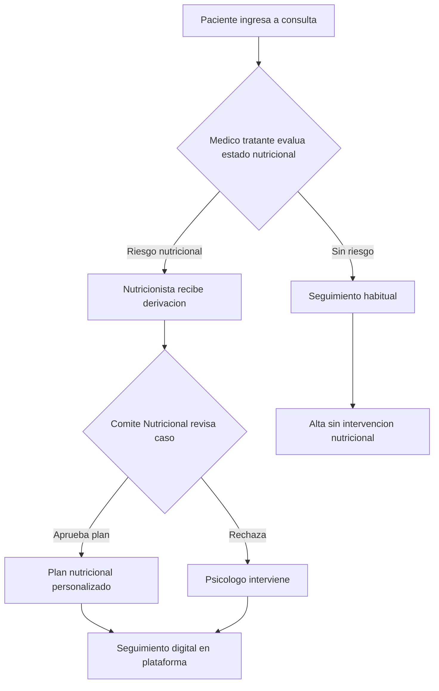
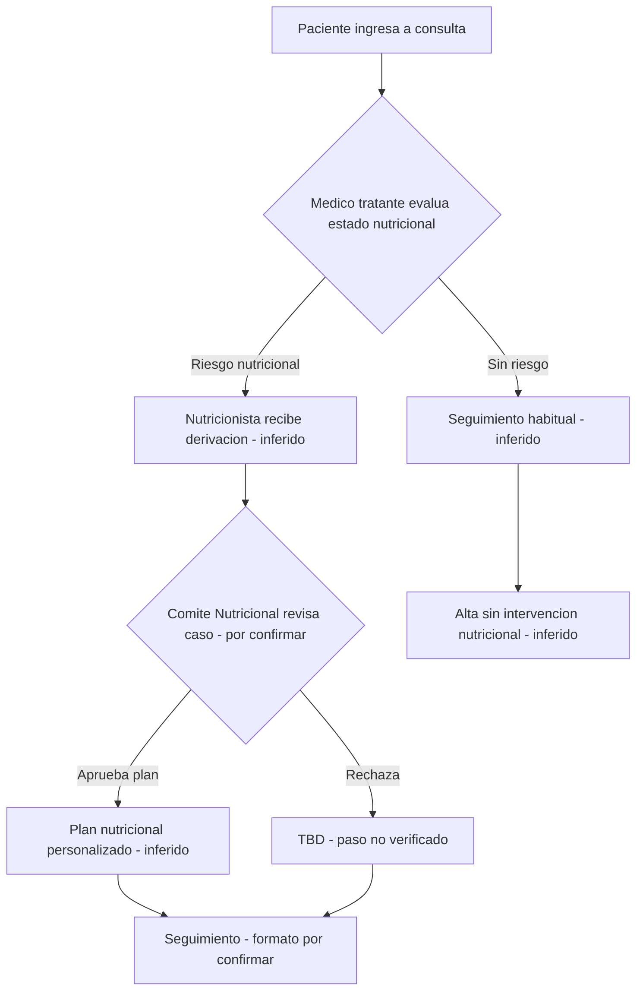

# Example Audit: FALP Nutrition Referral Process

## Source Diagram (Mermaid)



## Step 1: Inventory

| ID | Element | Node Label | Role/Actor | Process Description | Connection |
|----|---------|-----------|------------|-------------------|------------|
| ELEMENT-01 | Node A | Paciente ingresa a consulta | Paciente | Patient enters consultation | → B |
| ELEMENT-02 | Node B | Medico tratante evalua estado nutricional | Medico tratante | Physician evaluates nutritional status (decision node) | → C or → D |
| ELEMENT-03 | Node C | Nutricionista recibe derivacion | Nutricionista | Nutritionist receives referral | → E |
| ELEMENT-04 | Node D | Seguimiento habitual | (unassigned) | Standard follow-up | → I |
| ELEMENT-05 | Node E | Comite Nutricional revisa caso | Comite Nutricional | Committee reviews case (decision node) | → F or → G |
| ELEMENT-06 | Node F | Plan nutricional personalizado | (unassigned) | Personalized nutrition plan created | → H |
| ELEMENT-07 | Node G | Psicologo interviene | Psicologo | Psychologist intervenes | → H |
| ELEMENT-08 | Node H | Seguimiento digital en plataforma | (unassigned) | Digital follow-up on platform | (terminal) |
| ELEMENT-09 | Node I | Alta sin intervencion nutricional | (unassigned) | Discharge without nutritional intervention | (terminal) |

## Step 2: Classify

| Element | Tag | Rationale |
|---------|-----|-----------|
| ELEMENT-01 | 🟢 CONFIRMED | Patient entering consultation is the standard entry point for any clinical flow at FALP |
| ELEMENT-02 | 🟢 CONFIRMED | Medico tratante role is standard; nutritional screening at admission is documented FALP protocol |
| ELEMENT-03 | 🟡 INFERRED | Nutricionista receiving referral is reasonable for a nutrition process, but no FALP document explicitly confirms this specific step |
| ELEMENT-04 | 🟡 INFERRED | "Seguimiento habitual" when no risk detected — reasonable assumption based on standard clinical practice |
| ELEMENT-05 | 🟠 ASSUMED | "Comite Nutricional" — plausible that FALP has a nutrition committee, but no evidence of its existence or formal review step |
| ELEMENT-06 | 🟡 INFERRED | Personalized plan after approval — reasonable but not verified against FALP documentation |
| ELEMENT-07 | 🔴 FABRICATED | "Psicologo interviene" as a consequence of committee rejection — no basis in any known FALP process. This step was invented by the agent. |
| ELEMENT-08 | ⚪ OUTDATED | "Seguimiento digital en plataforma" — FALP previously used paper-based tracking; this may represent current state but stakeholder indicated the platform transition is incomplete |
| ELEMENT-09 | 🟡 INFERRED | "Alta sin intervencion nutricional" — reasonable exit condition but not explicitly documented |

## Step 3: Evidence Mapping

```
ELEMENT-01: Paciente ingresa a consulta
  Tag: 🟢 CONFIRMED
  Source: FALP standard clinical flow — patient admission is universal entry point
  Confidence: high
  Action: keep

ELEMENT-02: Medico tratante evalua estado nutricional
  Tag: 🟢 CONFIRMED
  Source: FALP protocol documentation — nutritional screening at admission
  Confidence: high
  Action: keep

ELEMENT-03: Nutricionista recibe derivacion
  Tag: 🟡 INFERRED
  Source: Inferred from standard referral patterns in clinical nutrition
  Confidence: medium
  Action: flag for confirmation — ask stakeholder if FALP has a dedicated nutritionist receiving referrals

ELEMENT-04: Seguimiento habitual
  Tag: 🟡 INFERRED
  Source: Inferred from standard clinical practice when no risk detected
  Confidence: medium
  Action: flag for confirmation — ask stakeholder what happens when no nutritional risk is identified

ELEMENT-05: Comite Nutricional revisa caso
  Tag: 🟠 ASSUMED
  Source: No evidence — assumed based on common hospital committee structures
  Confidence: low
  Action: replace with "(por confirmar)" — ask stakeholder if a nutrition committee exists at FALP

ELEMENT-06: Plan nutricional personalizado
  Tag: 🟡 INFERRED
  Source: Inferred from standard nutrition care process
  Confidence: medium
  Action: flag for confirmation — verify this is the actual output of the FALP nutrition process

ELEMENT-07: Psicologo interviene
  Tag: 🔴 FABRICATED
  Source: No basis — agent invented this step
  Confidence: N/A
  Action: REMOVE — replace with TBD or ask stakeholder what happens when committee rejects a case

ELEMENT-08: Seguimiento digital en plataforma
  Tag: ⚪ OUTDATED
  Source: Stakeholder indicated platform transition incomplete (previously confirmed paper-based)
  Confidence: medium
  Action: replace with "Seguimiento (formato por confirmar)" — clarify current tracking method with stakeholder

ELEMENT-09: Alta sin intervencion nutricional
  Tag: 🟡 INFERRED
  Source: Inferred from standard discharge logic
  Confidence: medium
  Action: flag for confirmation
```

## Step 3.5: Scope Selection

Elements: 9 (>5) → **Full audit (Steps 1-5)**

## Step 4: Audit Report

# Diagram Audit Report

**Diagram:** FALP Nutrition Referral Process
**Date:** 2026-05-28
**Elements audited:** 9
**Verdict:** FAIL

## Summary

| Tag | Count | Percentage |
|-----|-------|-----------|
| 🟢 CONFIRMED | 2 | 22% |
| 🟡 INFERRED | 4 | 44% |
| 🟠 ASSUMED | 1 | 11% |
| 🔴 FABRICATED | 1 | 11% |
| ⚪ OUTDATED | 1 | 11% |

**DRAFT threshold check:** 6/9 (67%) elements are 🟡 or worse → diagram is a **DRAFT** per 50% rule.

## Findings

### 🔴 FABRICATED (must fix)
- ELEMENT-07: "Psicologo interviene" has no basis in any known FALP process → Replace with TBD. Ask: "What happens when the nutrition committee rejects a case?"

### 🟠 ASSUMED (flag for confirmation)
- ELEMENT-05: "Comite Nutricional" assumed without evidence → Ask: "Does FALP have a formal nutrition committee? If so, who are its members?"

### 🟡 INFERRED (verify when possible)
- ELEMENT-03: Nutricionista receives referral → Ask: "Is there a dedicated nutritionist at FALP who receives referrals?"
- ELEMENT-04: Standard follow-up when no risk → Ask: "What is the current protocol when no nutritional risk is identified?"
- ELEMENT-06: Personalized nutrition plan → Ask: "What is the actual output of the nutrition evaluation process?"
- ELEMENT-09: Discharge without intervention → Ask: "Is 'alta sin intervencion' the standard exit for non-risk patients?"

### ⚪ OUTDATED (replace)
- ELEMENT-08: "Seguimiento digital en plataforma" → Stakeholder indicated platform transition incomplete → Replace with "Seguimiento (formato por confirmar)" until clarified

## Questions for Stakeholders
1. Does FALP have a formal nutrition committee (Comite Nutricional)?
2. Is there a dedicated nutritionist who receives referrals, or is it a shared role?
3. What happens when a nutrition case is rejected — does it go to another professional or back to the treating physician?
4. Is the digital platform fully operational for nutrition follow-up, or is paper still used?
5. What is the actual output document of a nutrition evaluation?

## Delivery Readiness
- [ ] ELEMENT-07 (🔴) resolved — removed or replaced with verified step
- [ ] ELEMENT-08 (⚪) corrected — tracking method confirmed
- [ ] ELEMENT-05 (🟠) confirmed or replaced with TBD
- [ ] ELEMENT-03, 04, 06, 09 (🟡) flagged for future verification
- [ ] Diagram legend includes confidence levels
- [ ] Diagram labeled as DRAFT until ≥50% elements are 🟢

## Step 5: Fix or Flag

### Recommended corrected diagram:



**Note:** This corrected version preserves the flow structure while clearly marking unverified elements. Do NOT deliver as confirmed until stakeholder answers the 5 questions above.
