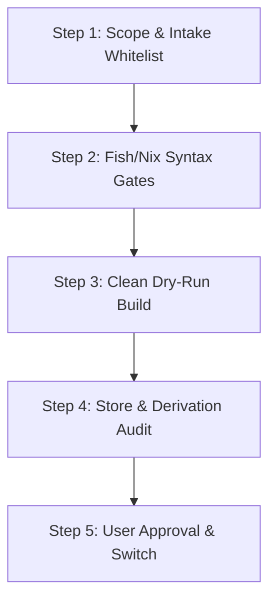

# 5-Step Governance Workflow & Verification Gates

## The 5-Step Execution Workflow



---

### Step 1: Scope & Intake Whitelist
* Identify exact files being modified (`flake.nix`, `fish.nix`, `starship.nix`, etc.).
* Classify side-effect level: `Local-write` vs `Git-mutating`.

---

### Step 2: Fish & Nix Syntax Gates
Before invoking Nix builds, ensure all edited scripts pass local linters:

```bash
# Fish code
fish_indent -w path/to/script.fish && fish_indent --check path/to/script.fish
fish -n path/to/script.fish

# Nix code
nix flake check
```

---

### Step 3: Clean Dry-Run Build (`home-manager build`)
* **Never run `home-manager switch` directly.**
* Run `home-manager build --flake .#<profile>` to compile the generation into `./result`.
* Verify that exit status is `0`.

---

### Step 4: Store & Derivation Audit
* Inspect `./result/home-files/` to ensure generated configuration matches expectations.
* Search for any accidentally leaked secrets in generated derivations
  using the 3-way gate (the grep exit code is the verdict — never the
  presence/absence of output):
  ```bash
  [ -d result/home-files ] || { echo "GATE ERROR: result/home-files missing — build output not found"; exit 2; }
  set +e
  grep -rn -E "(ghp_[A-Za-z0-9]{20,}|sk-[A-Za-z0-9_-]{20,}|token-[A-Za-z0-9_-]{10,}|password|BEGIN (RSA|OPENSSH|EC) PRIVATE KEY)" result/home-files/
  status=$?
  set -e
  case $status in
    0) echo "BLOCK: potential secret leaked into store derivation"; exit 1 ;;
    1) echo "Store is CLEAN" ;;
    *) echo "GATE ERROR: grep failed (exit $status) — never assume clean"; exit 2 ;;
  esac
  ```
* Note: bare `grep ... || echo CLEAN` is UNSAFE — exit code 2 (missing
  directory, permission error) would also print "CLEAN". The gate must
  branch on the exit code explicitly.
* Remove the `./result` symlink when audit passes:
  ```bash
  rm -f result
  ```

---

### Step 5: User Approval & Switch
Only switch with explicit user intent:

```bash
home-manager switch --flake .#<profile>
```

---

## Rollback & Generations Management

To list historical generations or revert to a previous working state:

```bash
# List all generations
home-manager generations

# Activate a specific previous generation
~/.local/state/nix/profiles/home-manager-XXX-link/activate
```
