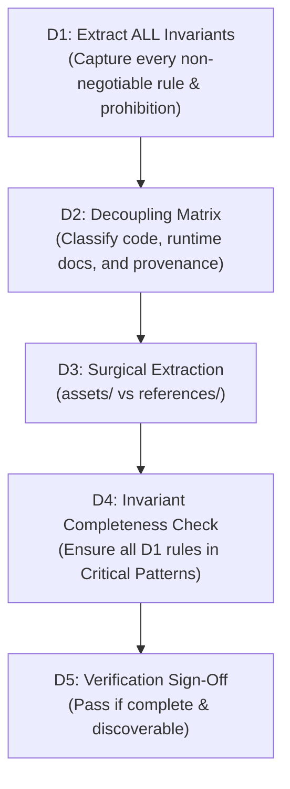

# Semantic-Lock Refactor Patterns (v2.1-R1)

Patterns for refactoring and decoupling large skills without losing behavioral invariants, negative prohibitions, or provenance.

---

## 1. When to Refactor

Apply Semantic-Lock progressive disclosure when:
- `SKILL.md` contains monolithic technical documentation, schemas, or templates that obscure top-level orchestration rules.
- Multiple sub-domains, language variants, or detailed CLI flags clutter the entrypoint.
- *Advisory guideline:* An entrypoint `SKILL.md` of ~150 lines is a target for human readability, but **semantic completeness and rule discoverability ALWAYS outrank line counts**. Never compress or truncate rules to meet a line quota.

---

## 2. The D1–D5 Semantic-Lock Protocol



### D1: Extract ALL Core Invariants
- Extract **all** non-negotiable rules, negative constraints ("DO NOT do X"), security boundaries, and prerequisite checks.
- Do NOT artificially restrict extraction to an arbitrary count (e.g. "3 to 5"). If a complex T3 skill has 9 independent prohibitions, extract all 9.

### D2: Decoupling Matrix
Classify components of the source document into distinct tiers:
- **Execution Code / Templates / JSON Schemas / Fixtures** $\rightarrow$ `assets/`
- **In-Depth Runtime Technical Guides** $\rightarrow$ `references/` (local relative markdown links)
- **Provenance & Upstream Citations** $\rightarrow$ `references/` (upstream source URLs permitted for provenance)
- **Sub-Phase SOP Workflows** $\rightarrow$ `resources/`

### D3: Surgical Extraction
- Move extracted files into their respective subdirectories.
- **Rule on Links:**
  - *Runtime Dependencies:* Must use **local relative markdown links** (ensures offline execution and zero network failure during agent runs).
  - *Provenance Attribution:* External URLs are permitted when citing the upstream repository, commit history, or documentation origin.

### D4: Invariant Completeness Check
Verify that **100% of D1 invariants** are preserved in `## Critical Patterns` in the entrypoint `SKILL.md`.

### D5: Verification Sign-Off
- **PASS Criteria:**
  1. Complete semantic coverage (zero lost negative constraints or prerequisites).
  2. Entrypoint `SKILL.md` is self-contained and independently actionable by delegators.
  3. All local relative references resolve on disk.
- **FAIL Criteria:**
  1. Any behavioral invariant dropped during refactoring.
  2. Unresolved or broken internal path references.
  3. Critical operational rule hidden where loaders or delegators cannot discover it.

---

## 3. Standard Decoupled Layout

```
skills/{skill-name}/
├── SKILL.md              # Main Orchestrator (Critical Patterns + Orchestration)
├── assets/               # Code templates, boilerplate, schemas, fixtures
│   ├── template.py
│   └── schema.json
├── references/           # Technical guides (local links) + provenance citations
│   └── architecture.md
└── resources/            # Sub-phase step guides (optional)
```
