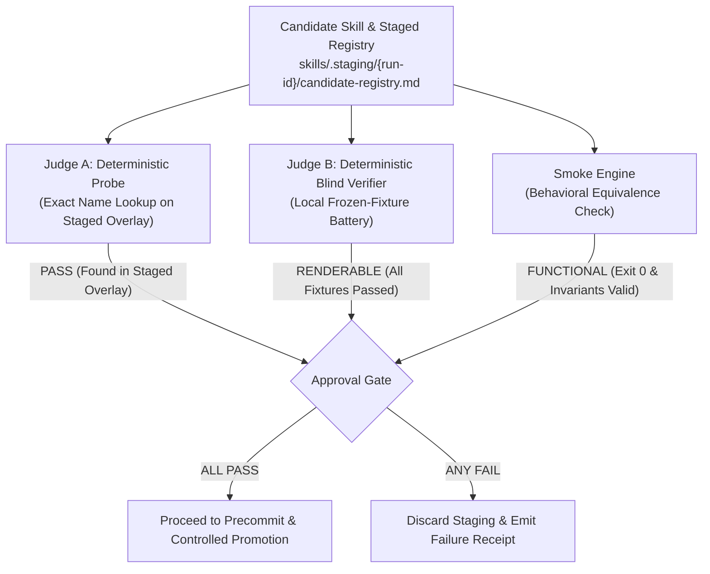

# Dual Blind Trigger & Verification Guide (v2.1-R2)

Guide for designing pre-frozen intent fixtures and executing adversarial candidate verification against the candidate overlay.

---

## 1. Candidate Registry Overlay Definition

The candidate registry overlay is formulated as:

$$\text{CANDIDATE REGISTRY OVERLAY} = (\text{LIVE REGISTRY BASE} \setminus \text{OLD SKILL ENTRY}) \cup \text{CANDIDATE ENTRY}$$

### Why Base + Delta is Mandatory:
If the test registry contained only the candidate skill in isolation, Judge B could never detect:
1. Keyword collisions with pre-existing skills.
2. Ranking demotions or near-miss confusions with neighboring tools.
3. Regression in global discovery resolution.

---

## 2. Standard Pre-Frozen Fixture Battery (Per Skill)

Fixtures must be generated and frozen during **Phase 3 (Semantic-Lock)**, *before* authoring or normalizing the frontmatter:

```json
{
  "skill_name": "<skill-name>",
  "run_id": "<run-id>",
  "fixtures": [
    {
      "id": "pos-1",
      "type": "direct_intent",
      "query": "create a postgres migration with rollback support",
      "expected_result": "SHOULD_TRIGGER"
    },
    {
      "id": "pos-2",
      "type": "direct_intent_variant",
      "query": "set up database schema migration scripts",
      "expected_result": "SHOULD_TRIGGER"
    },
    {
      "id": "pos-3",
      "type": "paraphrase",
      "query": "how do I add a new column in my database safely?",
      "expected_result": "SHOULD_TRIGGER"
    },
    {
      "id": "neg-1",
      "type": "near_miss_negative",
      "query": "explain the conceptual difference between SQL and NoSQL databases",
      "expected_result": "MUST_NOT_TRIGGER"
    },
    {
      "id": "neg-2",
      "type": "neighboring_skill_confusion",
      "query": "write a python script to query postgres using psycopg2",
      "expected_result": "MUST_NOT_TRIGGER"
    },
    {
      "id": "smoke-1",
      "type": "behavioral_smoke",
      "command": "python3 skills/.staging/{run-id}/candidate/scripts/helper.py --help",
      "expected_property": "exit_code_0_and_shows_subcommands"
    }
  ]
}
```

---

## 3. Dual Blind Verification Protocol



### Judge A: Deterministic Probe
- Validates exact-name presence via managed registry registration or hub lookup.
- **Verdict:** `PASS` or `FAIL`.

### Judge B: Deterministic Blind Verifier (Local Role — no external dispatch)
Judge B is a ROLE fulfilled entirely by `scripts/verify_candidate.py` running
locally and deterministically. No step in this protocol requires spawning sub-agents,
LLM sessions, or any harness-specific dispatch mechanism; if your environment cannot
dispatch anything extra, you can still execute Judge B to completion.

- Judge B receives **only**:
  1. Staged candidate registry overlay (its `### {skill-name}` description text).
  2. Pre-frozen intent query strings from `fixtures.json`.
- Judge B receives **NO**:
  - Author reasoning notes.
  - Frontmatter raw text or keywords.
  - Transformation logs.

**Deterministic decision rule** (implemented in `verify_candidate.py`):
- Normalize: casefold, extract `[a-z0-9]+` tokens, drop stopwords and tokens shorter
  than 4 characters ("informative tokens").
- Positive (`SHOULD_TRIGGER`) evidence: at least one informative common token AND
  overlap score ≥ `0.25`. Stopword-only or trivial-token queries can never trigger.
- Negative collision (`MUST_NOT_TRIGGER`, near-miss class): triggers violation when
  score ≥ `0.15`, or ≥ `2` shared discriminant tokens, or any shared token of length ≥ 8
  (a critical domain keyword).
- Neighbour-collision class uses its own bounds (score ≥ `0.12`, same absolute/critical counts).
- Arbitrary substring matching is PROHIBITED as evidence of intent overlap.

**Verdict:** `RENDERABLE` (all frozen positive fixtures trigger and no frozen negative
fixture collides) or `UNRENDERABLE`.

**Claim ceiling:** PASS authorizes exactly the claim "PASS against declared frozen
intent fixtures" — never universal semantic equivalence. Residual semantic nuance is
tracked as a successor finding (LLM-assisted Judge B), out of scope for this layer.

### Mandatory Adversarial Fixture Classes (beyond the standard battery)

Freeze these against candidates whose routing matters:

| Class | Fixture shape | Required outcome |
|---|---|---|
| A | positive query sharing ONLY stopword/trivial tokens with the candidate text | verifier rejects it (fails closed) |
| B | negative query sharing ONE critical domain keyword but low global overlap | flagged as collision → rejected |
| C | legitimate paraphrase using different surface wording but core intent terms | triggers and passes |
| D | neighbour skill query with close-but-distinct vocabulary and zero discriminant overlap | no false collision, passes as MUST_NOT_TRIGGER |

### Behavioral Smoke Test (Executable Skills)
- Executes the minimal smoke command against the staged skill script/tool.
- **Verdict:** `FUNCTIONAL` (returns expected exit code and output shape) or `BROKEN`.

---

## 4. Pass/Fail Decision Matrix

| Judge A | Judge B | Smoke Test | Action |
|---|---|---|---|
| `PASS` | `RENDERABLE` | `FUNCTIONAL` | **Advance to Phase 8 (Controlled Promotion with Compensating Rollback)** |
| `FAIL` | Any | Any | **Reject $\rightarrow$ Refine candidate registry generation** |
| `PASS` | `UNRENDERABLE` | Any | **Reject $\rightarrow$ Return to Phase 5 to refine description** |
| `PASS` | `RENDERABLE` | `BROKEN` | **Reject $\rightarrow$ Return to Phase 4 (Script defect in staging)** |
